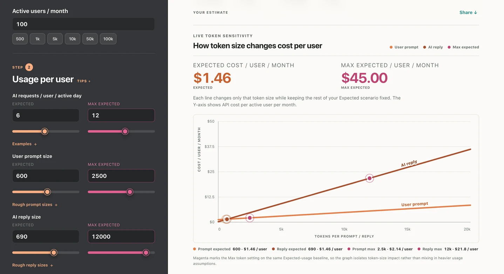

# AI Cost Estimator

**A simple guide to the monthly bill of your AI tool.** 12 AI models compared, with recommendations —
and what it costs when someone abuses it.

A free, single-file web tool that compares 12 models from OpenAI, Anthropic and Google. 
No signup, no backend, no database, no cookies. Everything runs in the browser. 

**→ [konradbuilds.github.io/ai-cost-estimator](https://konradbuilds.github.io/ai-cost-estimator/)**



---

## What it does

- **Monthly AI API cost - and cost per user**, from three steps: monthly users, usage per user, model
- **Expected vs max expected** — set a realistic figure and a heavier one, and every number
  becomes a range instead of one false-precision answer
- **Live token sensitivity chart** — how cost per user moves as prompt and reply size change,
  one variable at a time
- **"What does 500 tokens actually look like?"** — real examples, so nobody has to guess
- **Three cost levers to test first**, and a section on keeping usage under control
- **All 12 models priced on the same workload**, cheapest first, with a fit verdict on the one
  you picked — what to consider it for, and what to think twice about
- **Runaway cost** — what one abuser with no rate limit costs you in an afternoon
- **Share** — name the estimate and copy a link; the whole thing travels in the URL
- **Copy your report** as Markdown, ready to paste into an AI chat or a document
- Plain-English glossary, USD / EUR / GBP, print-to-PDF layout

## Files

| File | What it is |
|---|---|
| `index.html` | The whole tool, prices included. No build step, no dependencies, no webfonts. |
| `verify-models.js` | Sanity check for the prices. Run it before every commit. |
| `og.png`, `favicon.svg` | Social preview and icon. |
| `screens/` | Screenshots used in this README. |

The prices live **inside `index.html`**, in a single block:

```html
<script id="pricing-data" type="application/json"> … </script>
```

That block is the only source of truth. There is no separate `models.json` to keep in sync.

## Running it locally

Open `index.html` in a browser. That is it — one file, no server, no build.

## Prices

Every price is verified against the provider's own pricing page and carries the date it was checked.
Nothing comes from memory, and nothing is fetched at runtime — a pricing page that changes its
markup fails silently, and a cost tool that lies is worse than no cost tool.

Sources:

- [developers.openai.com/api/docs/pricing](https://developers.openai.com/api/docs/pricing)
- [platform.claude.com/docs/en/about-claude/pricing](https://platform.claude.com/docs/en/about-claude/pricing)
- [ai.google.dev/gemini-api/docs/pricing](https://ai.google.dev/gemini-api/docs/pricing)

### Updating prices

1. Re-read the three pages above.
2. Edit the `pricing-data` block in `index.html`: the rates, each model's `checked` date, and
   the top-level `checked`.
3. Run the guard rail:

```bash
node verify-models.js
# diff a candidate file against what is in the page:
node verify-models.js models.candidate.json
# pull the block out into models.json (if you ever want it as a separate file):
node verify-models.js --export
```

It exits `1` on an empty or partial model list, an implausible rate, a cached price above base
input, a non-https source, a stale or future `checked` date, or an expired promo price. Do not
commit on a red run.

### Shape of each model

```json
{
  "id": "gpt-6-sol",
  "api_id": "gpt-6-sol",
  "provider": "OpenAI",
  "label": "GPT-6 Sol",
  "input_per_mtok": 2.00,
  "cached_input_per_mtok": 0.20,
  "cache_write_per_mtok": null,
  "output_per_mtok": 10.00,
  "tier": "balanced",
  "good_for": "…",
  "avoid_for": "…",
  "source_url": "https://…",
  "checked": "2026-09-24"
}
```

`tier` is one of `frontier`, `balanced`, `fast` and drives the two recommendations.
`tier`, `good_for` and `avoid_for` are editorial judgement and labelled as such in the tool.
The prices are not.

Optional per-model: `promo_until` + `price_after_promo` for a temporary rate, `modes` for
verified batch / flex / fast multipliers, `notes` for anything a reader should see (a
tiered price, a disagreement between two provider pages).

## Deploying

GitHub Pages, from the repository root:

**Settings → Pages → Source: Deploy from a branch → `main` / `(root)`**

That is the whole deployment. To move to a custom domain later, rename `CNAME.example` to
`CNAME` and put one bare domain in it.

## Not in this version

Live price fetching. Accounts or saved estimates. A backend. Every model on earth.
Batch and priority rates in the calculation (they are explained, not calculated —
only OpenAI's are verified).

## No warranty

Every figure is a rough estimate. The tool exists to give you an order of magnitude and a range
to make a decision with, nothing more. It excludes VAT and other taxes, volume discounts, batch
and priority rates, rate-limit tiers, image and audio tokens, and per-request overheads. Check the
provider's own pricing page before you commit money to anything.

## Licence

[GNU General Public License v3.0](LICENSE) © 2026 Konrad Sroka —
a free tool by [Konrad](https://konrad.edgeone.dev).
